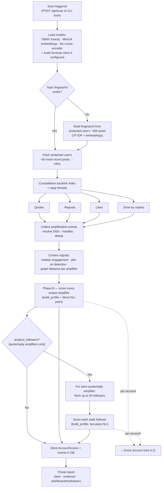
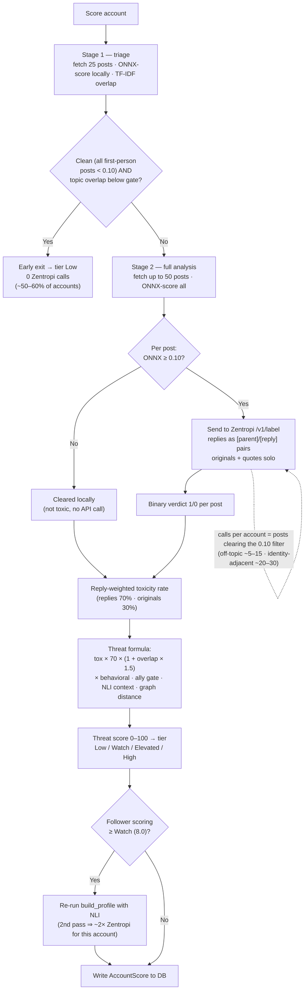
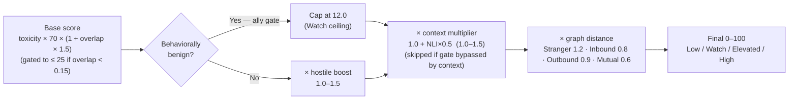

# How Charcoal's Classifier & Scorer Work, and How We Size Zentropi Usage

> Audience: engineering/product at Zentropi. Assumes familiarity with ML
> classification but not with Charcoal's codebase. Written to explain where
> Zentropi sits in our pipeline and how much traffic a single protected
> account generates.

## 1. What Charcoal is doing at a high level

Charcoal protects a single Bluesky user (the "protected account") by finding
other accounts likely to harass them. For each candidate account we produce a
**threat score** (0–100) and a **tier** (Low / Watch / Elevated / High). That
score is a blend of three signals:

- **Toxicity** — how often this account is actually hostile (this is where
  Zentropi comes in)
- **Topic overlap** — how semantically close their interests are to the
  protected user's
- **Behavioral/graph signals** — quote/reply ratios, pile-on participation,
  engagement, and social-graph distance

The key design principle: topic proximity alone is *not* a threat. An ally who
posts supportively about the same topics should score Low. The threat signal is
the **combination** of topical proximity and a **pattern of hostile behavior**.
Zentropi is what lets us measure "hostile behavior" accurately — which is why
it sits at the center of the system.

## 2. Why we use Zentropi at all (the two-stage classifier)

Our local toxicity model (an ONNX Detoxify model, `unbiased-toxic-roberta`) has
a well-known failure mode: it keyword-triggers on identity terms. "Fuck yeah,
fat liberation!" and "fat people are disgusting" both score ~0.95. Trusting
that model's high scores would systematically false-positive on exactly the
communities we're trying to protect.

So we treat the two models asymmetrically:

- **ONNX is trustworthy only for *low* scores.** A post scoring < 0.10
  genuinely contains no hostile language or identity terms — that's a reliable
  "obviously clean" signal.
- **ONNX high scores are not trusted at all.** Anything that isn't obviously
  clean gets handed to Zentropi, whose conversation-scoped policy can tell ally
  use of identity language from hostile use, third-party venting from a direct
  attack, and legitimate disagreement from harassment.

This gives us a **two-stage scorer**:

- **Stage 1 — ONNX clean-pass filter (free, local, no API calls).** Every post
  is scored locally. Posts below the 0.10 clean threshold are cleared and never
  sent to Zentropi.
- **Stage 2 — Zentropi binary classification.** Every post at or above 0.10 is
  sent to Zentropi's `/v1/label` endpoint, which returns a binary verdict
  (1 = toxic, 0 = safe) plus a confidence. **ONNX never contributes to the
  toxic count** — it only *subtracts* from the pool Zentropi has to look at.
  All actual toxicity decisions are Zentropi's.

A few operational details on our side of the integration:

- We call your pre-built **labeler** (`labeler_id`, optionally pinned to a
  `labeler_version_id`) rather than sending the full policy text per request.
- **Replies are sent as `[Parent post] / [Reply]` pairs** so the
  conversation-scoped policy can judge whether a reply is hostile toward the
  person it's answering. Originals and quote-posts are sent as solo text.
- Concurrency is capped at **4 in-flight requests** per account batch, with up
  to **3 retries** (exponential backoff) on 5xx/429/network errors.
- If no Zentropi key is configured, the whole thing degrades to ONNX-only with
  a 0.50 threshold — **zero calls**. Zentropi is the production path, not a
  hard dependency.

## 3. How one account gets scored (the per-account flow)

For each candidate account we run an **adaptive, staged** profile build so we
don't pay full cost on accounts that are obviously irrelevant:

**Stage 1 — cheap triage (25 posts, 0 Zentropi calls).**
We fetch ~25 recent posts (replies *and* originals), ONNX-score them locally,
and compute a quick topic-overlap estimate. If the account is **both** clean
(all first-person posts below 0.10) **and** topically irrelevant (overlap below
the gate), we stop here and classify it Low. This early-exits an estimated
**50–60% of accounts** at zero Zentropi cost.

**Stage 2 — full analysis (up to 50 posts, this is where Zentropi is called).**
For accounts that survive triage, we fetch up to 50 posts, ONNX-score all of
them, and **send every post scoring ≥ 0.10 to Zentropi**. From Zentropi's
binary labels we compute a **reply-weighted toxicity rate** (replies weighted
70%, originals 30%, since harassment shows up in replies, not original posts).
That rate feeds the threat formula:

```
raw_score = toxicity_rate × 70 × (1 + topic_overlap × 1.5)
```

then modified by behavioral signals, an "ally gate," a context multiplier (from
a separate local NLI model), and graph distance.

**The number of Zentropi calls for one account = the number of its (≤50) posts
that clear the 0.10 ONNX filter.**

That count depends heavily on the account's topic space:

- **Off-topic, clean accounts** (tech, cooking, sports): most posts score
  < 0.10, so **5–15 calls** — or **0** if they early-exit at Stage 1.
- **Accounts in identity-adjacent spaces** (the ones we most need to evaluate):
  ONNX flags identity terms routinely, so **40–60% of 50 posts** go to Zentropi
  → roughly **20–30 calls**.

One cost wrinkle worth flagging: for **followers that score above the Watch
threshold (≥ 8.0)**, we re-run the full profile build a second time to add NLI
context scoring. That second pass independently re-runs Stage 1 + Stage 2, so
**borderline/hostile followers can cost ~2× their Zentropi calls.** This affects
only the minority of accounts that already look threatening.

## 4. How many calls a single protected account generates per scan

A scan for one protected account fans out across two populations:

**(a) Amplifiers.** We pull, from the Constellation backlink index plus reply
threads, everyone who **quoted, reposted, liked, or drive-by-replied** to the
protected user's ~50 most recent posts. Every unique amplifier gets a full
profile build.

**(b) Followers of hostile amplifiers.** For **quote and reply amplifiers
only** (reposts and likes are lower-signal and skipped), we fetch up to **50
followers each** and score them too. This is the predictive part — the people
in a quote-dunker's audience are the likely next harassers.

So, per scan:

```
accounts_scored ≈ (unique amplifiers)
                + 50 × (quote/reply amplifiers)
```

minus any account already scored within the last **7 days** (we skip fresh
scores). Concretely, a protected account with, say, 10 amplifiers (4 of them
quote/reply) fans out to roughly **10 + (4 × 50) = ~210 candidate accounts** in
one scan — though deduplication and the freshness skip typically bring the
scored set well below that.

Then, **per account**, Zentropi calls follow the Stage-1/Stage-2 logic above.
Putting it together for that example:

- ~210 candidates → ~50–60% early-exit at Stage 1 (**0 calls each**)
- ~90 reach Stage 2 → averaging, say, ~15–25 Zentropi calls each
- → on the order of **1,500–2,500 Zentropi calls for a single full scan** of
  one protected account, with a long tail from the 2× re-scoring on above-Watch
  accounts.

The two biggest levers on that number are entirely in our control and worth
calling out:

1. **The 0.10 ONNX clean-pass threshold** — raise it and fewer posts reach
   Zentropi (at some recall cost).
2. **`max_followers_per_amplifier` (default 50) and the 7-day freshness
   window** — these set the fan-out and how often we re-pay.

## 5. The one thing we'd want to validate with you

The architecture deliberately sends **more** traffic to Zentropi than a naive
"ambiguous band" design would, because we refuse to trust ONNX's high scores.
For accounts in identity-adjacent topic spaces that means 40–60% of their posts
hit your API. The open question for us is **throughput/rate limits on your side
at steady state** — a single active protected account is ~1,500–2,500 calls per
scan, and the product vision is many protected users scanning on a daily
cadence. We'd like to understand your free-tier and paid-tier ceilings so we
can size this correctly (our documented fallback if needed is self-hosting
CoPE, but we'd much rather stay on your API).

## 6. Pipeline diagrams

The Mermaid sources below render inline on GitHub. Pre-rendered PNGs are also
checked in under `docs/diagrams/` (`pipeline-overview.png`,
`per-account-scoring.png`) for pasting into slides or email.

### 6.1 Overall scan pipeline (one protected account)

This is what runs end-to-end when a scan is triggered (web dashboard
`POST /api/scan` or the CLI `scan` command). The Zentropi calls all happen
inside the per-account "Score account" step, expanded in 6.2.



### 6.2 Per-account scoring (`build_profile`) — where Zentropi is called

Every candidate account (amplifier or follower) runs through this staged flow.
Stage 1 is entirely local and free; Stage 2 is the only place Zentropi is
called. Accounts already scored within 7 days are skipped before this runs.



**Reading the call volume off the diagram:** Zentropi is hit only on the
`ONNX ≥ 0.10 → Send to Zentropi` edge in 6.2, and only for accounts that pass
Stage 1 triage in 6.1. Multiply (accounts reaching Stage 2) × (posts per
account clearing the 0.10 filter) to get total calls per scan — on the order of
1,500–2,500 for one active protected account.

## 7. Scoring modifiers in detail

The `FORM` box in 6.2 (`toxicity × 70 × (1 + overlap × 1.5) × behavioral · ally
gate · NLI context · graph distance`) hides four distinct modifiers. They are
applied **in a fixed order**, each multiplying (or capping) the running score.
Order matters — see the two deliberate choices at the end of this section.



*(Pre-rendered: `docs/diagrams/scoring-composition.png`. A layperson-friendly,
click-through animation of this whole flow lives at
`docs/scoring-walkthrough.html` — open it in any browser.)*

### 7.1 Behavioral signals + the ally gate (`src/scoring/behavioral.rs`)

From the account's recent posts we derive `quote_ratio`, `reply_ratio`,
`avg_engagement` (likes+reposts received per post), and `pile_on`. These drive a
**branching** modifier — an account takes one path, not both:

- **Ally gate (benign path).** If **all** of `quote_ratio < 0.15`,
  `reply_ratio < 0.30`, `not pile_on`, and `avg_engagement > median_engagement`
  hold, the score is **capped at 12.0** (Watch ceiling). The engagement clause
  requires the account to be a *net creator*, not a serial reactor — this is
  what keeps a supportive ally who shares the protected user's topics and uses
  identity language from ever reaching High.
- **Hostile multiplier (non-benign path).** Otherwise multiply by
  `1.0 + quote_ratio×0.20 + reply_ratio×0.15 + (pile_on ? 0.15 : 0)` → a
  **1.0–1.5×** boost.

**Pile-on detection** groups amplification events by the targeted post and
slides a **24-hour window**; if **5+ distinct accounts** hit the same post
within any 24h span, all are flagged `pile_on`. Coordinated dogpiles surface
even when each individual account looks mild.

### 7.2 NLI context score (`src/scoring/nli.rs`)

A separate local model (DeBERTa-v3-xsmall cross-encoder, ~87MB) answers a
*different* question than Zentropi: not "is this post toxic?" but "what is the
relationship between *these two specific texts*?" For a pair (protected user's
post → other account's response) it scores five hypotheses and combines them:

```
hostile_signal    = max(attack, contempt, misrepresent)
supportive_signal = max(good_faith × 0.5, support × 0.8)
context_score     = clamp(hostile_signal − supportive_signal, 0.0, 1.0)
```

Genuine support (×0.8) and respectful disagreement (×0.5) *cancel* apparent
hostility. The result feeds the pipeline twice: as the **gate-bypass trigger**
(≥ 0.5 → skip the ally gate, catching concern trolls) and as a **context
multiplier** `1.0 + context_score×0.5` (**1.0–1.5×**). Pairs are the real event
texts for amplifiers, or embedding-matched *inferred* pairs for not-yet-collided
followers (the predictive path). Because it's multiplicative, context can only
amplify existing toxicity — zero toxicity stays zero.

### 7.3 Graph distance (`src/bluesky/relationships.rs`)

One `app.bsky.graph.getRelationships` call (batched 30 DIDs at a time) buckets
the account's tie to the protected user, each with a final-score weight:

| Relationship | Weight | Why |
|---|---|---|
| Stranger (no follow either way) | **1.2×** | no relationship → likeliest harasser |
| Follows you (inbound) | **0.8×** | opted into the content |
| You follow (outbound) | **0.9×** | protected user chose them |
| Mutual follow | **0.6×** | existing relationship → likely non-hostile |

### 7.4 Order of application (and two deliberate choices)

```
1. base      = toxicity × 70 × (1 + overlap × 1.5)        // overlap-gated if < 0.15
2. behavioral = ally-gate cap(≤12)  OR  base × boost(1.0–1.5)
3. context    = behavioral × (1.0 + context_score×0.5)     // 1.0–1.5×
4. final      = (context × graph_weight 0.6–1.2).clamp(0,100)
```

- **Graph distance is applied last, after the ally gate**, so it can never
  rescue or sink an ally — a capped mutual-follow ally just gets dampened
  further; the 1.2× stranger amplification only bites accounts already deemed
  non-benign.
- **The context multiplier is suppressed when the gate was bypassed by
  context** (so a concern troll isn't hit by context twice — once to break the
  gate, once as a multiplier). Preventing that double-count is the entire reason
  `apply_behavioral_modifier_contextual` returns a third "gate was bypassed"
  flag.

**Worked contrast (same topic overlap, opposite outcomes):**

| | Hostile stranger | Supportive mutual-follow |
|---|---|---|
| toxicity / overlap | 0.30 / 0.45 | 0.05 / 0.80 |
| base | ≈ 35 | ≈ 8 |
| behavioral | ×1.16 → 41 | ally gate → ≤ 12 |
| context | ×1.23 → 50 | ~no boost → 8 |
| graph | Stranger ×1.2 → **60** | Mutual ×0.6 → **5** |
| tier | **High** | **Low** |
